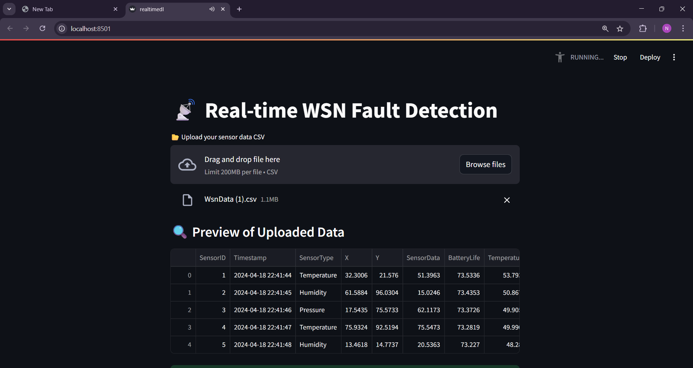

# WSN Fault Monitoring using Deep learning approach
This project implements a deep learning-based system to detect and classify faulty nodes in WSNs in real time. It has real-time metric tracking (accuracy, precision, recall, F1, ROC), confusion matrices, and a dynamic fault node graph for visualizing faulty sensor behavior. Built with Streamlit for an interactive interface.

The code is provided in realtimedl.py

Below are the result images (More images in the folder above in the repository named Results_Images):

